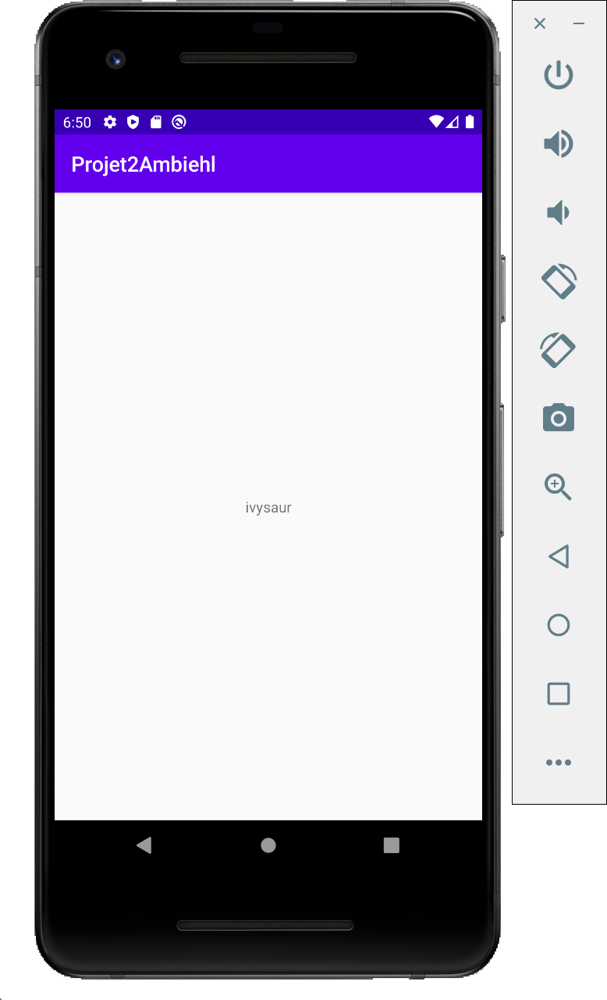

# Application POKEMON

## Projet réalisé par 

- Lucas AMBIEHL 3A

## Présentation

Simple projet démontrant l'utilisation de l'appel API Rest, et d'une Recycler View dans une application android.

Cette application affiche la liste des pokemon et utilise l'API du site pokeapi.co

## Prérequis


- Installation d'Android Studio<br/>


````
https://github.com/lucasambiehl/Projet2Ambiehl
````

## Consignes respectées : 

- Architecture MVC
- Appels REST
- Ecrans : 2 activités
- Affichage d'une liste dans un RecyclerView
- Affichage du détail d'un item de la liste
- Design Pattern
- Principe SOLID
- Fonctions supplémentaires :
	- Mise en cache


## Fonctionnalités: 


### Ecran Liste 


### Ecran du détail d'un élément

- Affiche le nom du pokémon




